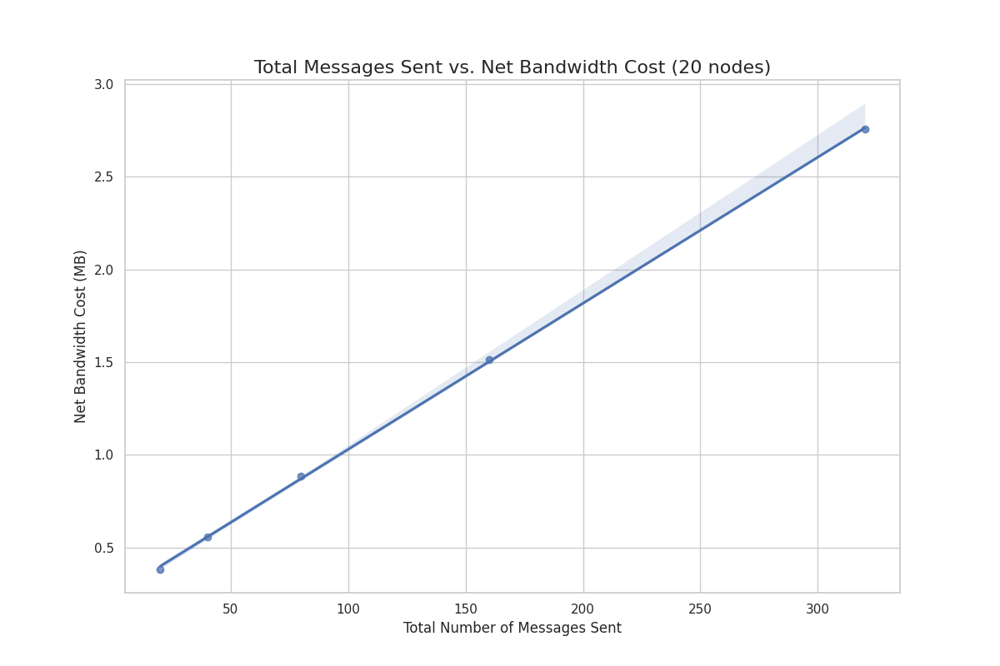
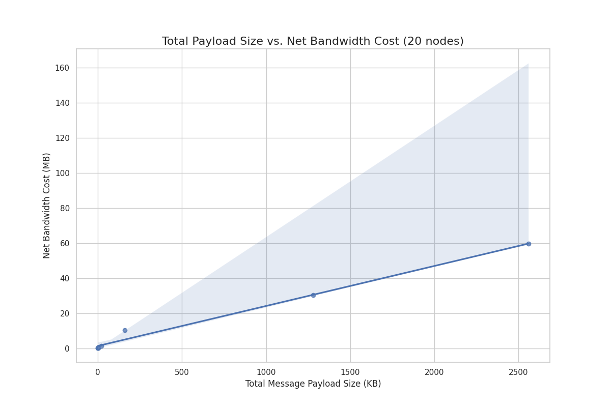

# Waku Performance Evaluation

Context: Waku is a family of decentralized, censorship-resistant communication
protocols for Web3 applications.

Performance evaluation of [nwaku](https://github.com/waku-org/nwaku) relay protocol.

What is being evaluated:

- [x] How the **number** of messages affects bandwidth.
- [x] How the **size** of messages affects bandwidth.
- [ ] How the **number** of messages affects delay.
- [ ] How the **size** of messages affects delay.
- [ ] How the **rate** of messages affects bandwidth and delay.

## Project Structure

- `src/`: Core libraries for experiment infrastructure

  - `mesh/`: Docker-based mesh network creation and management
  - `nwaku/`: HTTP client for nwaku node REST and metrics APIs

- `experiments/`: Executable analysis scripts that use the above libraries to:
  - Create test networks
  - Execute scenarios (publishing patterns, message configurations)
  - Collect metrics and generate visualizations

## How to Run

### Prerequisites

- Docker
- Python 3.12+
- [uv](https://github.com/astral-sh/uv)

### Setup and Execution

1. **Clone the repository and cd to it:**

   ```bash
   git clone <repository-url>
   cd <repository-name>
   ```

2. **Create a virtual environment and install dependencies:**

   ```bash
   uv venv
   uv sync
   ```

3. **Run an experiment:**

   ```bash
   # For the "Number of Messages vs. Bandwidth" experiment:
   uv run experiments/bandwidth/num_of_messages.py

   # For the "Message Size vs. Bandwidth" experiment:
   uv run experiments/bandwidth/size.py
   ```

Results will be saved as plots in the `results/` directory.

> Important: I didn't implement the support for cmd args.
> So for now, if needed, you have to change the experiment params
> in the experiment scripts themselves.

### With Nix

```bash
nix develop
# The shell will automatically create the venv and sync dependencies
# Then run experiments as shown above
```

## Experiment setup

The nwaku mesh is built with Docker:

1. A Docker network `d` is created
2. Then `n` Docker containers running a nwaku node each are deployed within `d`

> Each experiment run is a fresh network.
>
> After the mesh is used by the experiment and all necessary data is collected,
> both the Docker network and the created containers are cleaned up.

Between the `n` nodes, `m` act as bootstrap nodes.

Both `n` and `m` are arbitrarily chosen by the experiment script.

After the mesh is built, all nodes subscribe to the same pubsub topic.

To monitor the network's state with high fidelity, we poll metrics from
all nodes in parallel at one-second intervals. This high-resolution,
concurrent polling provides an accurate, time-series snapshot of network-wide
activity, allowing us to capture transient events and peak/valley points.

To save time when running the experiments, besides the act of polling the metrics,
the following operations run in parallel: deployment of nodes and
subscription to the pubsub topic.

> Depending on the experiment, it may also publish the messages concurrently as
> it's done in the `number of messages vs bandwidth` experiment.

### Wait times

There are wait times at the following points:

- After creation of the mesh: waiting for network to stabilize and nwaku's APIs to start.
- After subscribing to the pubsub topic: waiting for pubsub mesh formation and the general
  subscription state to be ready.
- After starting polling metrics: so that we can define a **baseline cost of an idle network**.
- After publishing messages: just to wait for the messages to arrive at the subscribers.

### Discovery

There is no discovery mechanism added because adding one would extend the duration of the experiments
as they would have to wait longer after the mesh is created to give time for peers to discover each other.

Currently, the experiments wait less than 20 seconds after the mesh is created to allow network
processes to stabilize.

> With a discovery mechanism, experiments may have to wait `x` minutes.

### Network topology

Since there is no discovery, the current topology is not very realistic since all non-bootstrap peers
are only connected to the bootstrap peers.

Real decentralized networks have more sparse connections between different peers.

Therefore, keeping the experiments duration the shortest possible, the ideal solution is to statically
create the network graph, connecting the peers through API calls.

Though, we would have to make sure no isolated networks (therefore more than one network) are created.

> How would we do that?
>
> To statically build the network graph, we can employ a sliding window
> algorithm-pattern. This method involves applying a fixed-size window to a
> sequence of nodes (e.g., 5 nodes at a time). Within each window, all nodes
> are connected to each other, forming a small, fully-meshed clique. The window
> then slides forward by a set number of steps (e.g., 2 nodes), and the
> connection process is repeated. By ensuring the step size is smaller than the
> window size, we create overlapping peer groups, which guarantees a single,
> fully connected network without any isolated partitions.

## Aggregation of multiple experiments

To understand the relationship between an independent variable (like message size or message count)
and a dependent variable (like bandwidth consumption), we run a series of experiments.
Each experiment is a distinct run with a different value for the independent variable.

For example, in the "Number of Messages vs. Bandwidth" experiment, we run the simulation with 1 message per node,
then again with 2 messages per node, then 4, and so on. Each of these is a complete, independent trial on a fresh network.

The results from all these separate runs are then collected and plotted on a single aggregate graph.
This graph plots the independent variable on the x-axis (e.g., Total Number of Messages) against the resulting
dependent variable on the y-axis (e.g., Net Bandwidth Cost).
This visualization allows us to clearly see the trend and determine how changes in the input variable affect network performance.

To understand more, read the experiments READMEs.

## Bandwidth experiments:

Both experiments follow the same methodology: **running
multiple independent experiments** with varying parameters (e.g.,
number or size of messages) and **aggregating** the results to identify trends.

### Metrics

For the bandwidth experiments, the `libp2p_network_bytes_total` metric is used. It's exposed by the
nwaku's metrics endpoint.

This metric is a cumulative counter that captures all libp2p traffic (incoming and outgoing) of a given node.

> There is no reason to differentiate between incoming and outgoing traffic since we want to measure
> the total bandwidth usage. Therefore, we just sum both values.

For both experiments, we calculate the net bandwidth cost throughout the experiment
by subtracting the final bandwidth from the initial bandwidth.

This eliminates the base network noise of an idle network.

### Number of Messages vs. Bandwidth

This experiment investigates how bandwidth scales with
message volume. In each trial, all `n` nodes publish
`x` messages concurrently.

Thus the total number of messages published in a single run
is `n * x`.

> To isolate the effect of message count as the sole
> variable, all messages use a minimal 1-byte payload. This
> ensures that bandwidth variations are due to the number of
> messages and their protocol overhead, not payload size
> differences.

**Number of nodes: 20**
**Number of messages for each experiment unit used**: `[1, 2, 4, 8, 16]`



### Message Size vs. Bandwidth

This experiment measures how payload size affects bandwidth
consumption. A single publisher sends `x` messages with
varying payload sizes.

Messages are published `x` times to ensure the resulting traffic
is reliably captured by our 1-second polling interval and that
the measurement represents a stable average, minimizing the impact
of random fluctuations

**x = 20**
**Number of nodes: 20**
**Message sizes for each experiment unit used**:

```py
# REMINDER: the publisher publishes the same message 20 times
# So total payload size is 20 * payload_size
payload_size_configs = [
    1,  # 1 byte (check y-intercept)
    16,  # 16 bytes
    64,  # 64 bytes
    128,  # 128 bytes
    1 * 1024,  # 1 KB
    8 * 1024,  # 8 KB
    64 * 1024,  # 64 KB
    128 * 1024,  # 128 KB
    # Nwaku message limit: 153.6 KB
]
```



### Conclusions

1.  **Linear Scaling**: Both experiments show a strong linear
    relationship. This suggests that bandwidth usage in `nwaku`
    scales predictably with message volume and size, without
    unexpected exponential overhead.

2.  **Low Message Overhead**: The near-zero y-intercept on both
    plots indicates that the fixed protocol overhead for sending
    a message is very low. This makes it efficient to send many
    small messages, as the cost is dominated by payload size,
    not message count.

3.  **Payload Size is the Dominant Cost Driver**: Bandwidth
    consumption is driven by payload size far more than by
    message count. For total payloads under 20 KB, the network
    cost is negligible. However, beyond this, the cost grows
    substantially. For perspective: propagating a 2.5 MB total
    payload (sent as 20 messages of 128KB each) consumed ~60 MB
    of network traffic, while sending over 300 minimal-payload
    messages consumed only ~2.8 MB.

> Reminder:
>
> Total payload size is not the payload size of a single message
> but the payload size of a single message multiplied by the number
> of times the message is published which for this size-bandwidth
> experiment, all messages were published 20 times.

TODO: calculate slope for each experiment

## Limitations

### Ideal network conditions

Experiments were run on a local Docker network with all containers running within the same host.
Thus it does not take into account real-world network conditions of multi-host and multi-region nodes.

Is it still useful though? I would say yes because we still can catch performance bottlenecks coming from
network protocol processing, such as the number of control messages that peers exchange when publishing
a message in a pubsub topic. Regardless of whether all nodes are running on the same host, the
number of control messages will be the same and we still can identify this kind of bottlenecks with
these local experiments.

Using a multi-host and multi-region experiment setup we could identify other kinds of bottlenecks
such as:

1. Latency-induced bottlenecks: inefficient peer scoring as a result of high latency, gossipsub mesh instability...
2. Packet loss: the packet loss within a single-host environment is probably 0, and therefore protocols for handling
   packet loss cannot be evaluated. A multi-host experiment would take that into account.

### Static network

No nodes joined or left the network during tests; therefore, there was no churn. This does not reproduce a real-world
decentralized network scenario.

It is not that complex to add some dynamism to the network. A simple way to do it is to have a specific list
of peers that continually enter and leave the network at a dynamic frequency. Experiments won't take
these peers in account when measuring metrics (or maybe they will).

### Validating scenarios

An experiment setup may be validated before analyzing metrics.

Example: if we're evaluating how bandwidth scales with the number of messages, before analyzing metrics,
we may have to assert (or wait for) whether all peers received all the messages in the first place. Peers not
receiving messages would be an indication that the high number of messages is causing a network overload.

## Future work

### Reliability of experiment run units

Each experiment unit was run just once.

So if we're testing how the number of messages affects bandwidth, we're running each one
of the following inputs only once: `[1, 2, 8, 16...]` (each element is the number of total
messages published).

It would be more reliable, if we ran each experiment unit multiple times so that we could
average out the results and eliminate fluctuations between experiments.

The code change here is simple: we just have to add one additional loop when running experiment
units as `for t in range(NUM_TRIALS):`.

Though, the experiments would get longer and more bug-prone.

> There are some unfixed bugs, so the longer an experiment runs, the more likely it is to fail.
>
> The main one is port binding for the APIs which sometimes it's already in use since we're deploying
> nodes in parallel.
>
> Solution is superficially described on the [backlog](#backlog) section of this README.

### Delay & Rate Analysis

Investigate how delay is affected by: number, payload size and rate of messages.

Also, how the rate of messages affects bandwidth.

#### How would we measure delay?

We need two values here: timestamp of when the message was published and the timestamp
of when it was received by the node.

When publishing messages:

1. Add a `meta` label for the message ID
2. Store both the timestamp and the message ID

Then we get the received messages info for each peer with: `GET /relay/v1/messages/{pubsubTopic}`.

Now it's just a matter of comparing the timestamps of published and received messages of same ID.

> With regard to whether we are testing the number, payload or rate of messages.. it really
> doesn't matter because what will be changed for each is just the business logic of publishing.

### Play with Gossipsub parameters

We used the latest unmodified image of nwaku to run the experiments.

It would be nice to play with Gossipsub parameters and see how the experiments results change.

## Backlog

- [ ] feat: calculate slope number
- [ ] tests: unit/integration tests for `src/` code
- [ ] feat: statically build mesh
- [ ] fix: reserve port or retry when port is already in use
- [ ] feat: execute experiments in parallel when doing aggregation
- [ ] feat: run several trials for the same experiment for more reliable results
- [ ] feat: store each result with a timestamp
- [ ] fix: retry when hundreds of nodes
- [ ] feat: num_vs_delay
- [ ] feat: set params through cmd args
- [ ] feat: bootstrap nodes proportional to num of nodes OR make it part of cmd args
- [ ] fix: check if container name is already being used before starting it
  - or simply stop using container names
- [ ] refact: move `black` to `uv` (remove from flake.nix)
